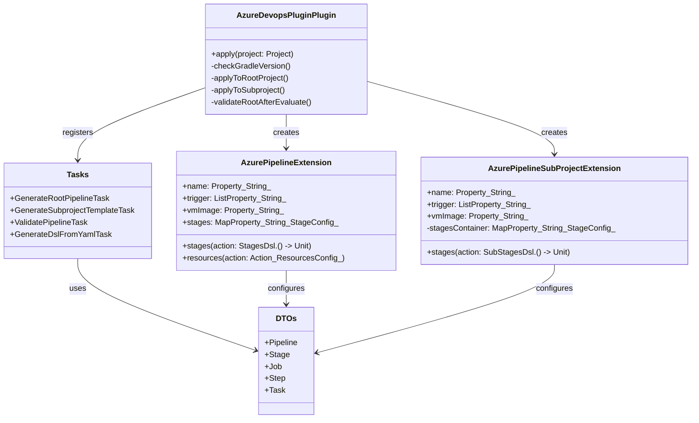

# Azure DevOps Pipeline Plugin

[](https://github.com/Jonatha1983/azure-devops-plugin/actions/workflows/build.yaml)
[](https://codecov.io/gh/Jonatha1983/azure-devops-plugin)

The Azure DevOps Pipeline Plugin is a [Gradle](https://docs.gradle.org/current/userguide/userguide.html) plugin that
allows you to generate Azure DevOps pipeline YAML files from your Gradle project.


## Features

- Generate Azure DevOps pipeline YAML files from Gradle DSL.
- Support for a multi-project builds with template inheritance.
- Pipeline validation task to ensure generated YAML matches expectations.
- YAML to DSL conversion utility for existing pipelines.

## Diagram



## Contributing

### Plugin Development

If you find a bug or would like to contribute to the plugin, you can follow the steps below to get started:

1. Clone the repository:
    ```shell 
    git clone git@github.com:Jonatha1983/azure-devops-plugin.git
    ```
2. Import the project into your IDE
3. Make your changes and run the tests
    ```shell
    ./gradlew clean check
    ```
4. Create a pull request

If you just have a question or would like to report a bug, please open an issue with much detail as possible, including but not only:

- The version of the plugin you are using.
- The version of Gradle you are using.
- The version of Java you are using.
- The operating system you are using.
- The steps to reproduce the issue.
- The expected behavior.
- The actual behavior.
- Any other relevant information—screenshots, stack traces, etc.

---

### See the full [documentation](https://jonatha1983.github.io/azure-devops-plugin/azure-devops-pipeline-plugin.html) for more information.

